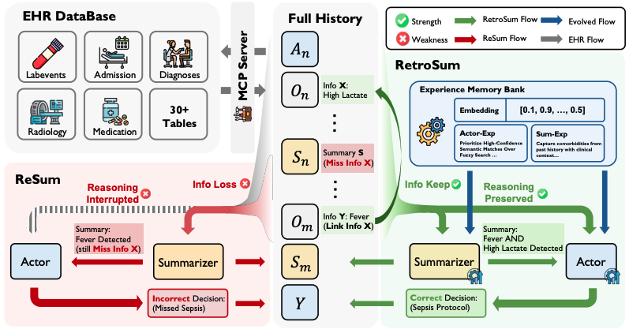

# AGENTEHR: Advancing Autonomous Clinical Decision-Making via Retrospective Summarization

<div align="center">

[](https://arxiv.org/pdf/2601.13918) 
[](https://huggingface.co/datasets/BlueZeros/AgentEHR-Bench) 

</div>

<p align="center">
  
</p>

We present **AGENTEHR**, a novel benchmark designed to bridge the gap between idealized experimental settings and realistic clinical environments. Unlike previous tasks that focus on factual retrieval (e.g., searching for a specific medication), AGENTEHR challenges agents to perform complex **clinical decision-making**—such as diagnosis and treatment planning—directly within raw, high-noise EHR databases. 

To address the information loss inherent in long-context clinical reasoning, we propose **RETROSUM**, a framework that unifies a **retrospective summarization mechanism** with an **evolving experience strategy**. RETROSUM achieves performance gains of up to **29.16%** over baselines while reducing interaction errors by up to **92.3%**.


----------------------------------------
## 🔖 **TOC**
  * [**Key Features**](#--key-features--)
  * [**Benchmark Structure**](#--benchmark-structure--)
  * [**Quick Start**](#--quick-start--)
    + [**Step 1: Environment Setup**](#step-1-environment-setup)
    + [**Step 2: Database Preparation**](#step-2-database-preparation)
    + [**Step 3: Running Agents**](#step-3-running-agents)
  * [**Methods: RETROSUM**](#--methods-retrosum--)
  * [**Citation**](#citation)

----------------------------------------

## 💡 **Key Features**
* **Realistic Clinical Benchmark**: Covers six core tasks (Diagnoses, Labevents, Microbiology, Prescriptions, Procedures, and Transfers) spanning the entire patient hospitalization lifecycle.
* **Toolbox MCP Server**: A standardized interface providing agents access to over **19 specialized tools**, including SQL execution, temporal filtering, and semantic search.
* **Retrospective Reasoning**: A novel mechanism that re-evaluates the entire interaction history to capture latent correlations and ensure logical coherence.
* **Experience Memory Bank**: An evolving strategy that crystallizes successful strategies into an external memory bank, allowing agents to learn from past trials.

----------------------------------------

## 📊 **Benchmark Structure**
AGENTEHR is organized into three experimental subsets based on MIMIC-IV and MIMIC-III to evaluate generalization and robustness:

| Subset | Distribution Type &nbsp; &nbsp; &nbsp; &nbsp; &nbsp; &nbsp; &nbsp; &nbsp; &nbsp; &nbsp; &nbsp; &nbsp; &nbsp; &nbsp; &nbsp; &nbsp; &nbsp; &nbsp; &nbsp; | Description |
| :--- | :--- | :--- |
| **MIMIC-IV-Common** | In-Distribution | Primary benchmark assessing standard clinical reasoning capabilities on prevalent conditions. |
| **MIMIC-IV-Rare** | Label-Shift OOD | Evaluates the agent's ability to handle low-prevalence diseases where parametric knowledge is weaker. |
| **MIMIC-III** | Systemic-Shift OOD | Presents fundamental differences in table schema and higher recording density/noise. |

----------------------------------------

## ⚡ **Quick Start**

### **Step 1: Environment Setup**
```bash
git clone https://github.com/BlueZeros/AgentEHR.git
cd AgentEHR
pip install -r requirements.txt
pip install -U vllm
```

### **Step 2: Database Preparation**
You can prepare the data in three ways depending on your requirements:

#### Option 1: Use Paper Data (Recommended) 
Download the dataset from [AgentEHR-Bench](https://huggingface.co/datasets/BlueZeros/AgentEHR-Bench). Copy the `EHRAgentBench` and `MIMICIIIAgentBench` folders into the `./data` folder in your root directory.

#### Option 2: Build More Samples (Based on MIMIC-IV) 
All samples for the 6 tasks in MIMIC-IV are stored in `MIMICIVBench/all`. You can use these directly to sample more metadata and create additional .db files as follow:
```bash
# label-wise sampling
bash ./scripts/data_preprocess/label_wise_sample.sh

# patient db file generation
bash ./scripts/data_preprocess/generate_patient_db.sh
```

#### Option 3: Build Entirely New Tasks (Based on MIMIC-IV) 
Modify existing task scripts to adapt to new requirements:
1. Adapt `./data_preprocess/meta_sql_data_generation.py` to generate task-specific metadata.

2. Adapt `./data_preprocess/candidate_processing.py` to construct corresponding candidate tables and standardized label spaces.


### **Step 3: Running Agents**
To evaluate an agent method on the AgentEHR task with a specified summarization window $w$ (e.g., 10 turns)
```bash
# run_vllm_server
bash ./scripts/run/run_vllm_server.sh

# run_mcp_server
bash ./scripts/run/run_mcp_server.sh

# run agent methods in ./scripts/method_run
bash ./scripts/method_run/qwen3_30b_moe_react.sh
```

<!-- ## Citation
If you find our work helpful, please cite our submission:
```bib
@article{agentehr2026,
  title={AGENTEHR: Advancing Autonomous Clinical Decision-Making via Retrospective Summarization},
  author={Anonymous},
  journal={ACL submission},
  year={2026}
} -->
```